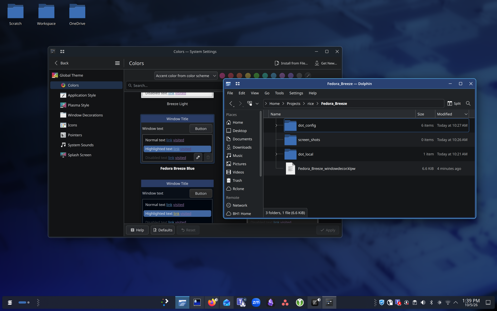
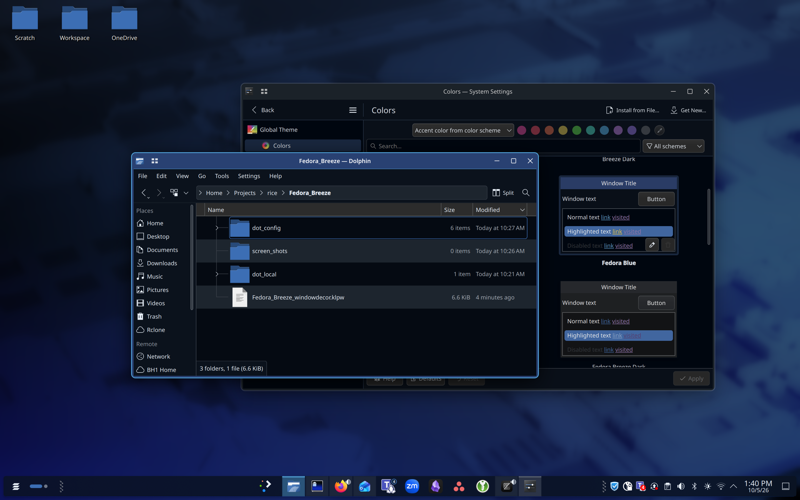
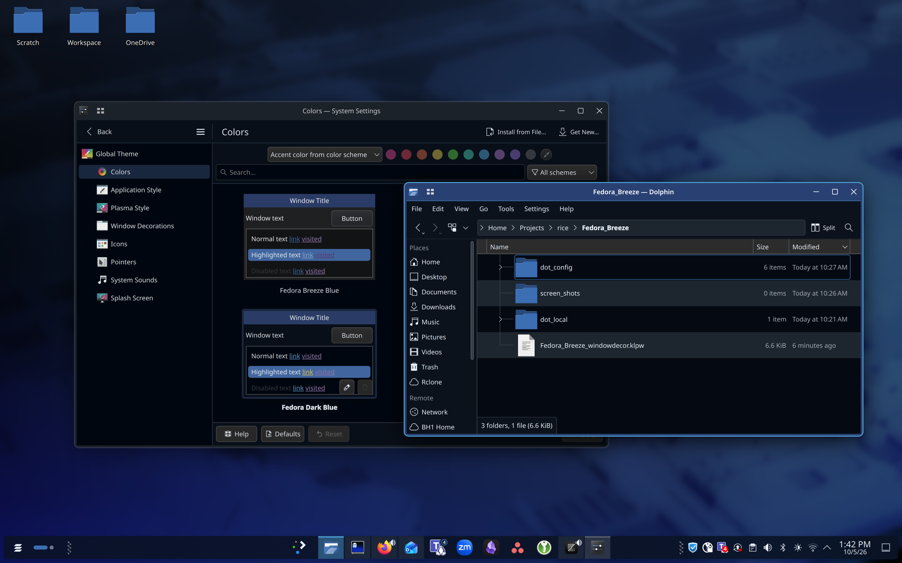
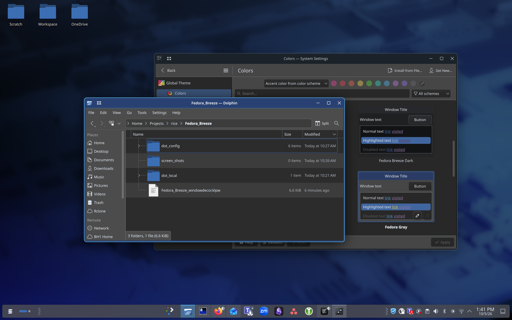
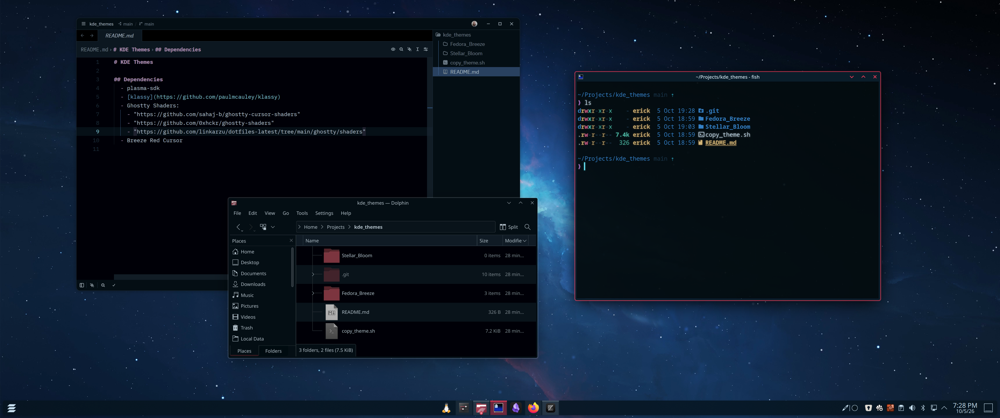

# KDE Themes

## Dependencies
  - plasma-sdk (For Plasma Global Theme Explorer)
  - [klassy](https://github.com/paulmcauley/klassy)
  - Ghostty Shaders:
    - "https://github.com/sahaj-b/ghostty-cursor-shaders"
    - "https://github.com/0xhckr/ghostty-shaders"
    - "https://github.com/linkarzu/dotfiles-latest/tree/main/ghostty/shaders"
  - [Breeze Red Cursor](https://web.archive.org/web/20241126231354/https://www.opendesktop.org/p/999991/) - Deleted by author.

  > **NOTE:** Additional KDE widgets, Kwin scripts, etc can be found in: [Resources.md](Resources.md)

# Themes

## Fedora Breeze

### Variants
| Fedora Blue | Fedora Dark Blue | Fedora Gray |
|---|---|---|
|  |  |  |

### Color Palette
|  |  |
|---|---|
|  |  |
|  |  |
|  |  |
|  |  |
|  |  |
|  |  |
|  |  |
|  |  |

## Stellar Bloom

### Color Palette
|  |  |
|---|---|
|  |  |
|  |  |
|  |  |
|  |  |
|  |  |
|  |  |
|  |  |
|  |  |
